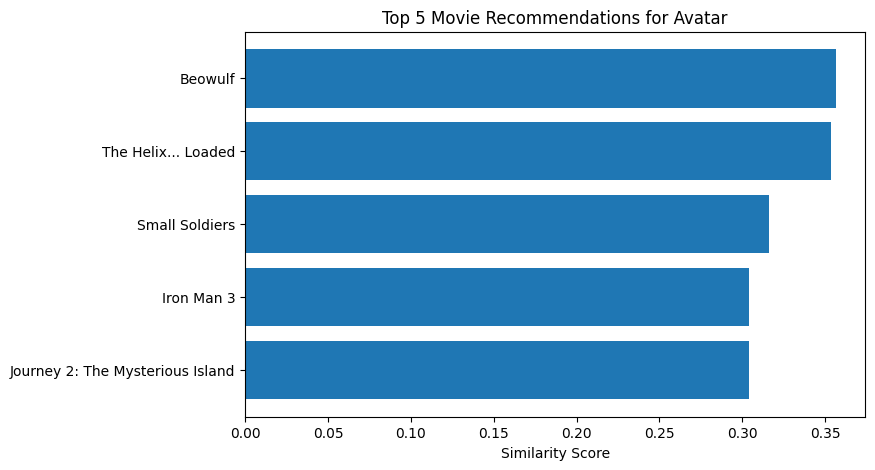
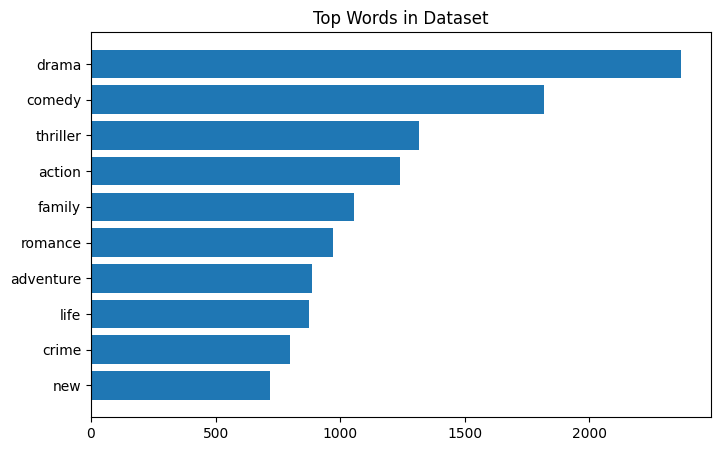

# 🎬 Movie Recommendation System (ML + NLP)

A content-based movie recommendation system built using Machine Learning and Natural Language Processing (NLP).  
It recommends similar movies based on metadata such as overview and genres.

---

## 🚀 Project Overview

This project analyzes movie descriptions and genres to suggest similar movies using text similarity techniques.

---

## 🧠 Techniques Used

- Natural Language Processing (NLP)
- CountVectorizer
- Cosine Similarity
- Feature Engineering

---

## 📊 Features

- Recommend similar movies based on user input
- Uses movie overview + genres
- Displays top 5 recommendations
- Visualizes similarity scores
- Shows most important words in dataset

---

## 📂 Dataset

- TMDB 5000 Movies Dataset (Kaggle)

---

## 🛠️ Tech Stack

- Python
- Pandas
- NumPy
- Scikit-learn
- Matplotlib

---

## 📸 Results

### 🎯 Similar Movies for Input

---

### 📊 Top Words (NLP Insight)

---

## 🌐 Streamlit App

An interactive web application built using Streamlit that allows users to enter a movie name and get instant recommendations.

### 🚀 Features

- User-friendly interface
- Real-time movie recommendations
- Powered by NLP-based similarity model

### ▶️ Run Locally

---

## 🌐 Streamlit App (Live UI)

